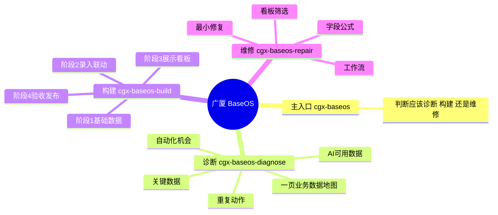

# 广厦 BaseOS（CGX BaseOS）

广厦 BaseOS 是一个面向一人公司、企业服务团队和中小企业的经营数字化技能。它的核心不是替代 ERP、CRM 或某个 SaaS，而是帮助企业识别关键数据、沉淀可复用的经营数仓，让人和 AI 都能围绕同一套数据录入、查询、汇总、提醒和分析。

最新版本：v1.0.0

它不按 ERP、CRM、OA、BI 等传统软件模块切分企业，而是按业务主链路、经营数据资产和 AI 可调用性组织第一版最小系统。

开发原则是少就是多。当前只保留一个主入口和三个核心子技能。



## 目录结构

```text
.
├── SKILL.md             # 技能运行入口：只放主入口路由
├── skills/              # 主入口 + 诊断 + 构建 + 维修
├── agents/              # 技能在 Codex / OpenAI 界面里的展示配置
├── references/          # 技能按需读取的运行时参考资料
├── docs/                # 项目开发背景、架构、路线图和开发方案
├── templates/           # 构建技能按需读取的模板资源
├── tools/               # 多技能打包与本地安装脚本
├── examples/            # 真实或模拟业务案例、提示词和输出样例
├── tests/               # 技能评测用例、回归测试和验收清单
├── scripts/             # 稳定复用的辅助脚本
└── external-references/ # 本地外部参考项目，不进入技能运行上下文
```

## 安装

### 通用安装方式（适用于 Codex / Claude Code）

```bash
npx -y skills add guangxia321/cgx-baseos -g --all
```

### GitHub Release / Trae Solo 手动安装

从 GitHub Releases 下载 `cgx-baseos-1.0.0.zip`。总包里包含四个独立 skill zip：

1. `cgx-baseos.zip`：主入口，必须先装。
2. `cgx-baseos-diagnose.zip`：业务数据诊断与 AI 数仓判断。
3. `cgx-baseos-build.zip`：四阶段构建、重构、模板资源、经营财务结构、看板新建和飞书 Base 落地。
4. `cgx-baseos-repair.zip`：已有系统维修排障。

如果工具要求一个 zip 对应一个 skill，就解压总包后逐个上传 `individual/` 里的四个 zip。

## 更新

通过 `npx skills add` 安装的用户，重新运行同一条命令即可：

```bash
npx -y skills add guangxia321/cgx-baseos -g --all
```

手动安装的用户，下载最新版 GitHub Release，替换旧版本 skill。

## 当前公开技能

- `cgx-baseos`：主入口，只判断用户应该进入诊断、构建还是维修。
- `cgx-baseos-diagnose`：业务数据诊断，输出“一页业务数据地图”。
- `cgx-baseos-build`：基于业务数据地图，按“基础数据层 -> 录入与联动层 -> 展示看板层 -> 验收发布层”构建、重构和落地飞书 Base。
- `cgx-baseos-repair`：修复已有 Base、字段、公式、lookup、看板、筛选器和工作流问题。

模板、经营财务、看板新建和飞书 CLI 准备仍然保留，但只作为构建技能内部资源：

- 经营财务：`references/finance-scenarios.md`
- 飞书 CLI 准备：`references/feishu-cli-setup.md`
- 看板新建：`references/dashboard-build-rules.md`
- 模板资源：`templates/*/schema.md`

## 用户怎么用

用户不需要记技能名，直接描述业务问题：

- “我想知道公司哪些数据能接入 AI。”
- “我们员工每天重复整理 Excel，想看看怎么自动化。”
- “我已经有一页业务数据地图，帮我搭到飞书 Base。”
- “旧的多维表字段太乱，想重构。”
- “飞书看板月份筛选不动，帮我修。”

主入口会先判断路径。正常流程是：先诊断出一页业务数据地图，再进入构建；已有系统出错时直接进入维修。

## v1.0.0 内容

首个正式版本已经包含：

- 主入口 + 诊断 + 构建 + 维修的公开技能结构。
- 业务数据诊断和一页业务数据地图格式。
- 构建流程对模板、经营财务、看板新建和飞书 CLI 的内部整合。
- 构建技能内部四阶段：基础数据、录入联动、展示看板、验收发布。
- 销售系统、一人公司、企业服务、经营财务四类阶段化模板骨架。
- 第一套路由和诊断产物测试用例。
- 构建脚本可生成四个公开技能 zip 和统一整包。

后续版本会继续补充真实业务案例、模板字段、飞书 Base 落地验收和更多维修回归用例。

## 本地构建

```bash
bash tools/build-skills.sh
```

构建产物会生成到 `dist/skills/`：

- `cgx-baseos-1.0.0.zip`
- `individual/cgx-baseos.zip`
- `individual/cgx-baseos-diagnose.zip`
- `individual/cgx-baseos-build.zip`
- `individual/cgx-baseos-repair.zip`

## 许可证

本项目采用 CC BY-NC 4.0 许可证。个人学习、研究和非商业项目可以使用；公开发布衍生作品请注明来源；商业用途需要单独授权。
