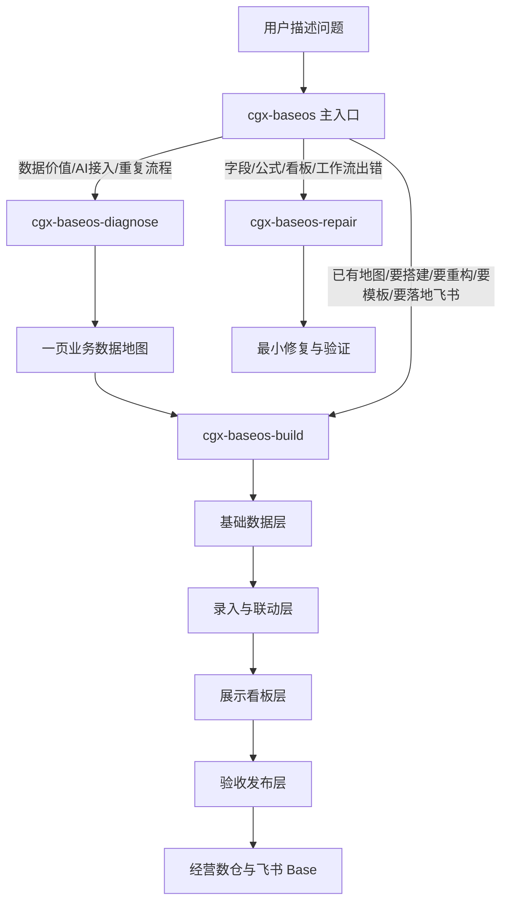

# 广厦 BaseOS 设计框架

## 核心判断

广厦 BaseOS 当前采用“一个主入口 + 三个核心子技能”的结构。用户不应该在一堆软件模块里选择，而是先围绕业务数据资产展开沟通：什么数据最关键、什么动作最重复、什么数据能被 AI 使用、什么流程应该简化。

模板、经营财务、看板新建、飞书 CLI 准备都不再作为独立技能暴露，它们是构建技能内部按需调用的资源和步骤。

## 公开技能结构

| 技能 | 职责 | 不做什么 |
| --- | --- | --- |
| `cgx-baseos` | 主入口路由，判断进入诊断、构建还是维修 | 不承载长流程和模板细节 |
| `cgx-baseos-diagnose` | 业务数据诊断，输出一页业务数据地图 | 不直接建表，不给完整 ERP 方案 |
| `cgx-baseos-build` | 基于地图按四阶段构建/重构经营数仓，按需使用模板、财务、看板新建、飞书 CLI | 不跳过诊断直接搭真实系统，不把看板独立成公开入口 |
| `cgx-baseos-repair` | 修复已有系统的字段、公式、看板、筛选器、工作流问题 | 不默认重建整套系统 |

## 诊断层

诊断技能回答的是“企业为什么要做数字化，以及哪些数据值得沉淀”。固定产物是一页业务数据地图，包含：

- 业务类型与当前阶段。
- 关键业务对象。
- 重复动作与自动化机会。
- 已有数据与可迁移资产。
- 漏分析数据与关键指标。
- 推荐录入方式。
- 第一版最小构建范围。

这张地图是构建技能的输入，避免一上来按传统 ERP 或 SaaS 模块建表。

## 构建层

构建技能同时处理：

- 从 0 构建。
- 基于旧表重构。
- 输出字段清单或模板。
- 经营财务结构。
- 看板新建。
- 飞书 CLI 准备和 Base 实施。

构建时只做第一版最小主链路，优先降低录入成本。内部固定分成四个阶段：基础数据层、录入与联动层、展示看板层、验收发布层。看板是第三阶段，必须基于前两层稳定字段和样例数据设计，不能反向决定数据模型。

## 维修层

维修技能独立运行，只处理已经搭好的系统问题。它先定位最小对象：字段、公式、lookup、视图、看板组件、筛选器、工作流或记录。只有当局部修复解释不了问题，才建议回到诊断或构建层。

## 资源边界

- `skills/cgx-baseos-build/references/finance-scenarios.md` 是经营财务内部能力。
- `skills/cgx-baseos-build/references/dashboard-build-rules.md` 是新建看板内部能力。
- `skills/cgx-baseos-build/templates/*/schema.md` 是构建资源，不是独立技能。
- `skills/cgx-baseos-build/references/feishu-cli-setup.md` 是飞书落地前置步骤。
- 每个公开子技能目录自带运行所需 `references/` 和 `templates/`，避免源码使用和 Release 安装时路径不一致。
